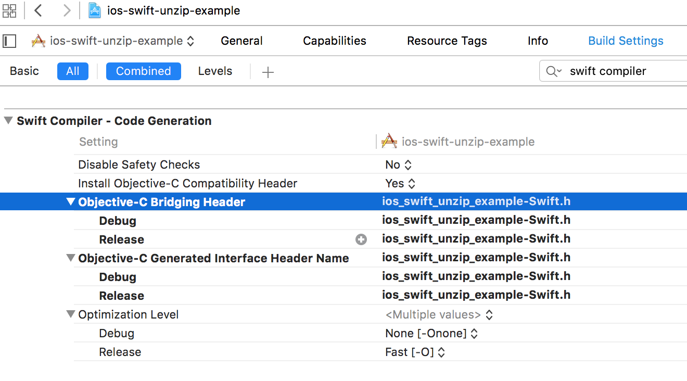

# iOS Swift example App for opening a .zip file
A minimal project using [SSZipArchive](https://github.com/ZipArchive/ZipArchive) for opening a .zip file. The main instructions for including the code is in that project's Readme but there is one more little thing to do in order to use that code from Swift and requires creating an Objective-C bridging header file ([Importing Code from Within the Same App Target at Apple Developer's Site](https://developer.apple.com/library/ios/documentation/Swift/Conceptual/BuildingCocoaApps/MixandMatch.html#//apple_ref/doc/uid/TP40014216-CH10-XID_76)), trivial but required!

Note: the only output is sent to the console.

--------- 
# Ejemplo en Swift de una aplicación iOS para abrir un archivo .zip
Un proyecto mínimo usando [SSZipArchive](https://github.com/ZipArchive/ZipArchive)  para abrir un archivo .zip. Las instrucciones principales para poder incluir ese código están en el Readme de ese proyecto pero hay una pequeña cosa extra que hacer para poder utilizar el código desde Swift y requiere crear un archivo .h que sirve de puente entre Objective-C y Swift ([Importing Code from Within the Same App Target at Apple Developer's Site](https://developer.apple.com/library/ios/documentation/Swift/Conceptual/BuildingCocoaApps/MixandMatch.html#//apple_ref/doc/uid/TP40014216-CH10-XID_76)),  ¡algo trivial pero requerido!

Nota: la única salida del programa es a la consola.

